# TaskMaster
------------------------------------

### Overview

an Android app with three main pages: the homepage, add a task, and all tasks page.
The homepage should have a header section, an image to represent the "my tasks" view, and buttons to
navigate to the add and all tasks pages. The add a task page allows users to input details about a
new task such as the title and body. Once the user submits the details, the page displays a "
submitted" label. The all tasks page is a simple page with an image and a back button and does not
require any functionality.

### ScreenShot

---------------------------------------

# Adding Data to TaskMaster

### Overview

Add new pages : Task Detail Page and Settings Page, and update the Home Page by
adding some buttons and the username from the setting page.

### ScreenShot

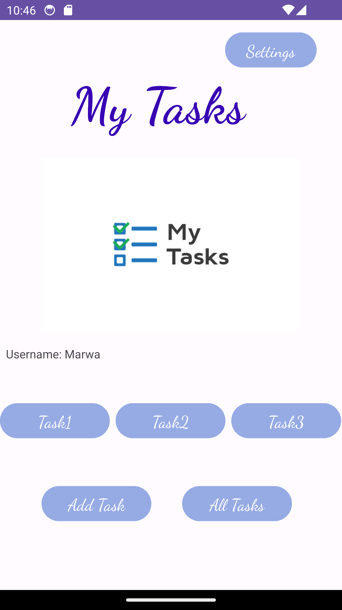
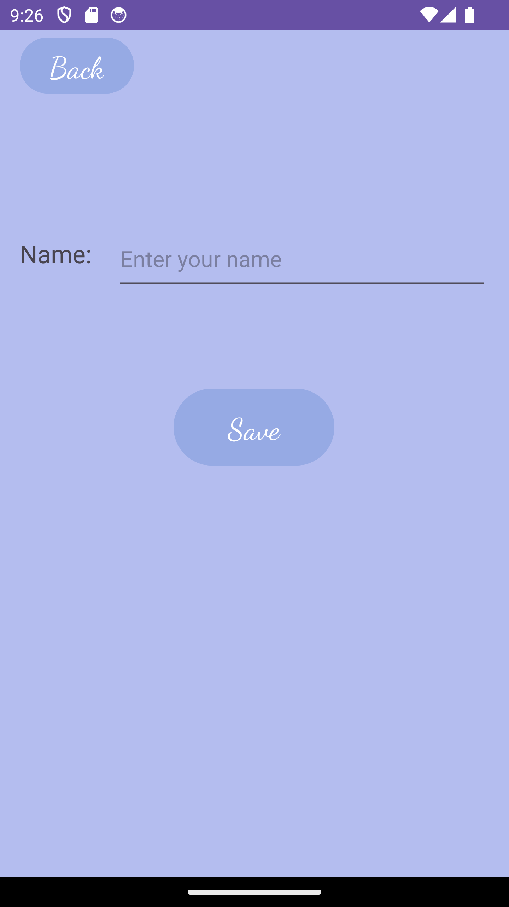
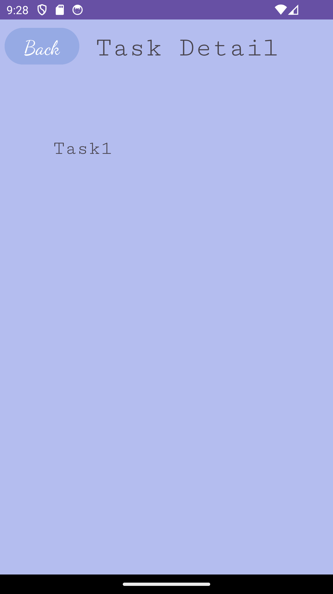

------------------------------------------

# RecyclerViews for Displaying Lists of Data

### Overview

This task involves creating a Task class with a title, a body, and a state. The state should be one
of "new", "assigned", "in progress", or "complete". The homepage should then be refactored to use a
RecyclerView for displaying Task data, with at least three hardcoded Task instances populating the
RecyclerView/ViewAdapter. Finally, the RecyclerView should have the ability to launch the detail
page with the correct Task title displayed when a specific Task is tapped.

### ScreenShot

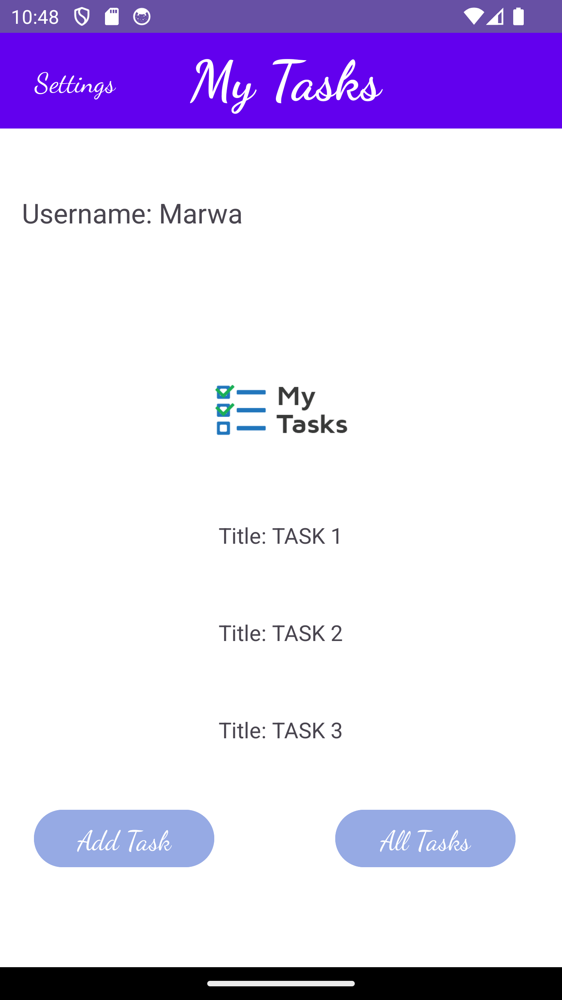
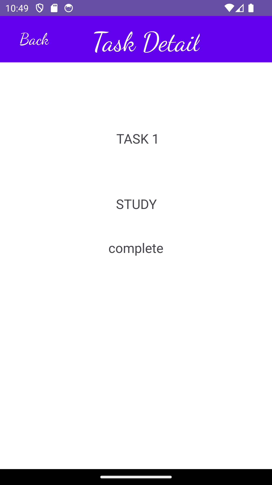
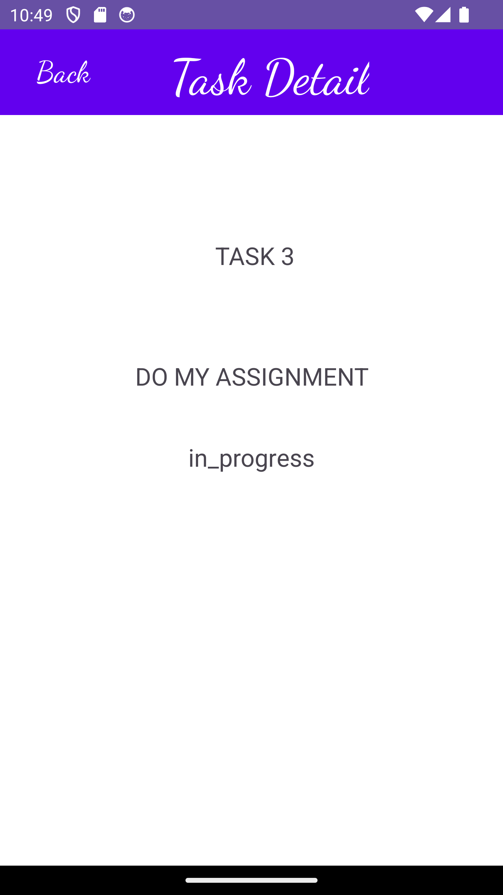

--------------------------------------------------

# Saving Data with Room

### Overview

In this task, we will set up Room in our application and modify our Task class to be an Entity. This
will enable us to save Task data to our local database. We will also modify the Add Task form to
save the entered data as a Task in the database. also we will refactor the homepage RecyclerView to
display all Task entities in the database. Finally, we will ensure that the description and status
of a tapped task are also displayed on the detail page, in addition to the title.

### ScreenShot

  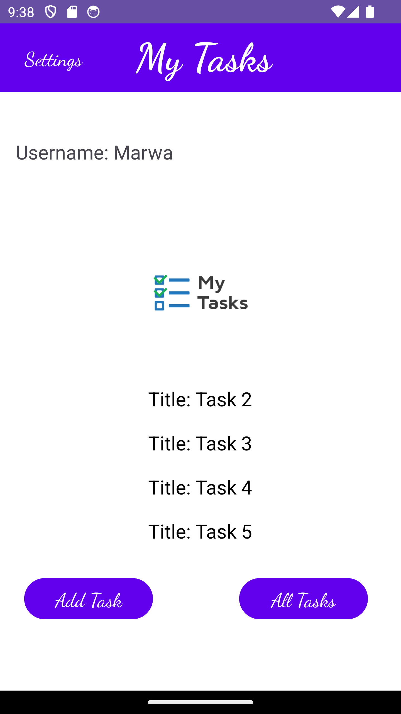
  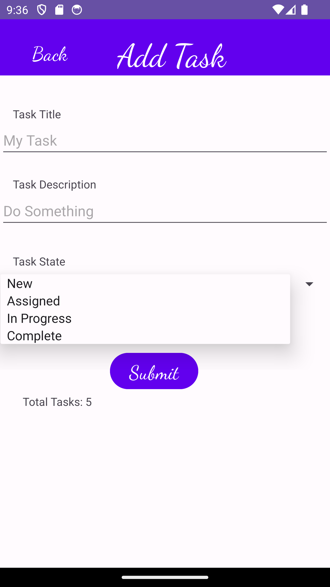

  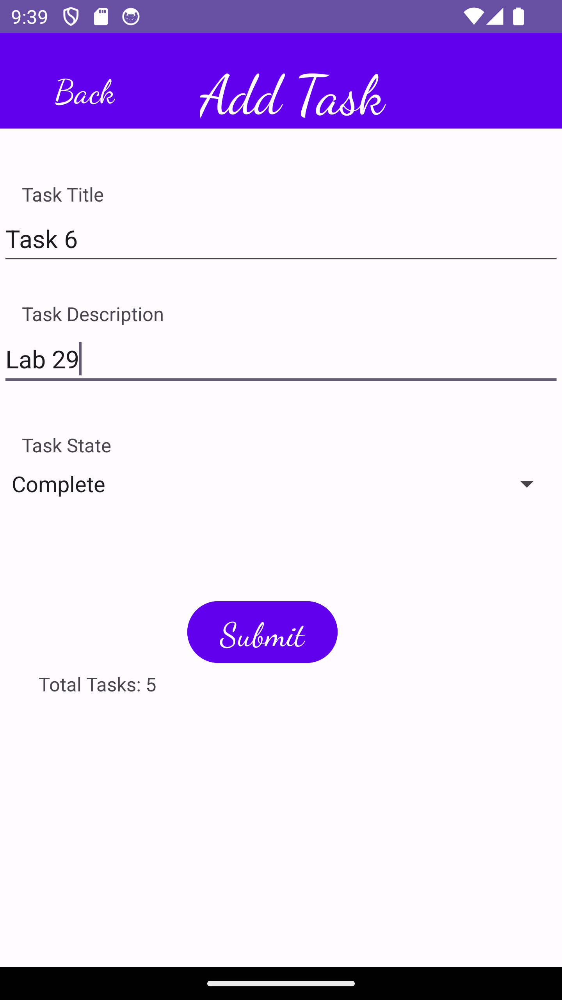
  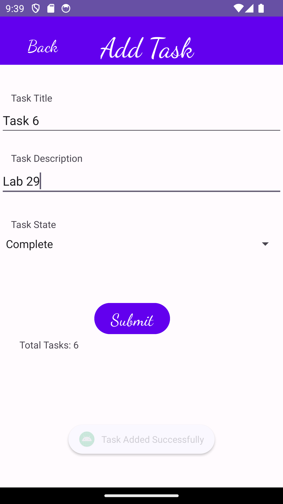

  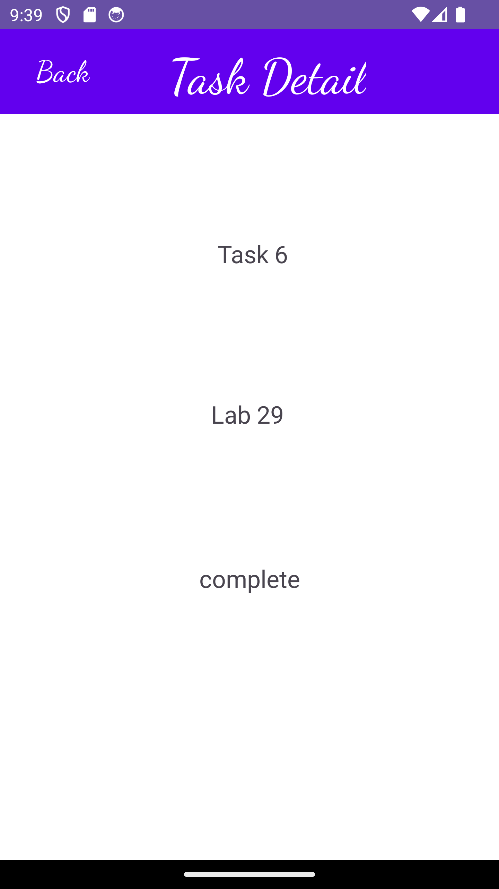

--------------------------------------------------

# Testing Views with Espresso

add more Espresso UI tests to the application, and complete/fix up/polish any remaining feature tasks from previous labs.

# lab32:Integrating AWS for Cloud Data Storage.

# lab33:Another Day, Another Model
### Overview 
1. Create a new entity for Team with a name and a list of tasks.
2. Update your existing Task entity to be owned by a Team.
3. Manually create three teams by running a mutation three times in your code.
4. Modify the Add Task form to include a Spinner or Radio Buttons for selecting the team that the task belongs to.
5. Allow the user to choose their team on the Settings page in addition to their username.
6. Use the selected team to display only that team's tasks on the homepage.
### screenshots

  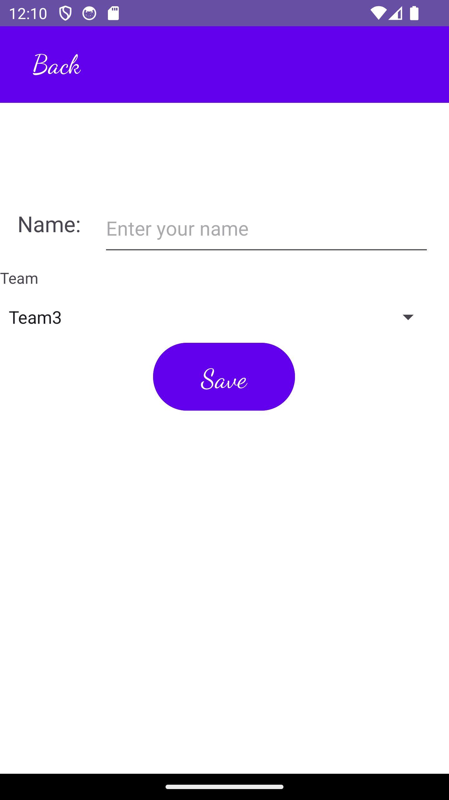
  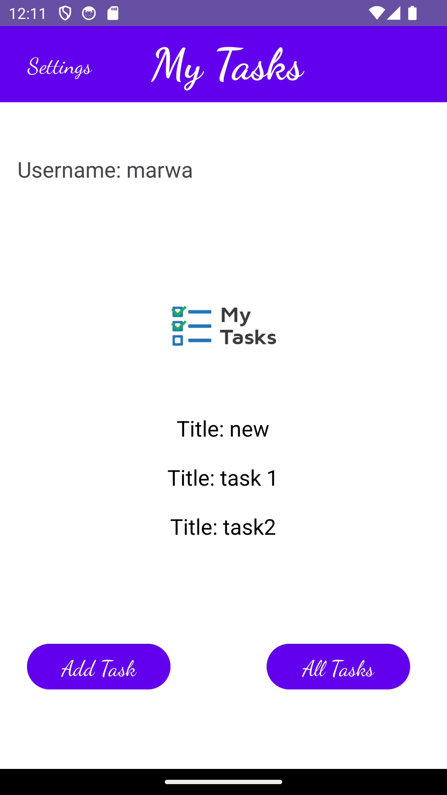

