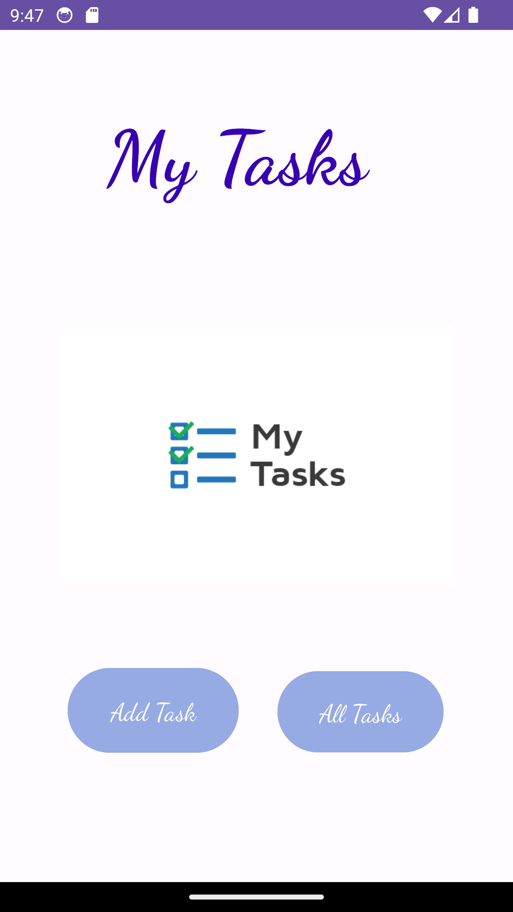

# TaskMaster 
------------------------------------
### Overview
an Android app with three main pages: the homepage, add a task, and all tasks page.
The homepage should have a header section, an image to represent the "my tasks" view, and buttons to navigate to the add and all tasks pages. The add a task page allows users to input details about a new task such as the title and body. Once the user submits the details, the page displays a "submitted" label. The all tasks page is a simple page with an image and a back button and does not require any functionality.
### ScreenShot

-------------------------------------------
# Adding Data to TaskMaster 

### Overview
Add new pages : Task Detail Page and Settings Page, and update the Home Page by
adding some buttons and the username from the setting page.
### ScreenShot

